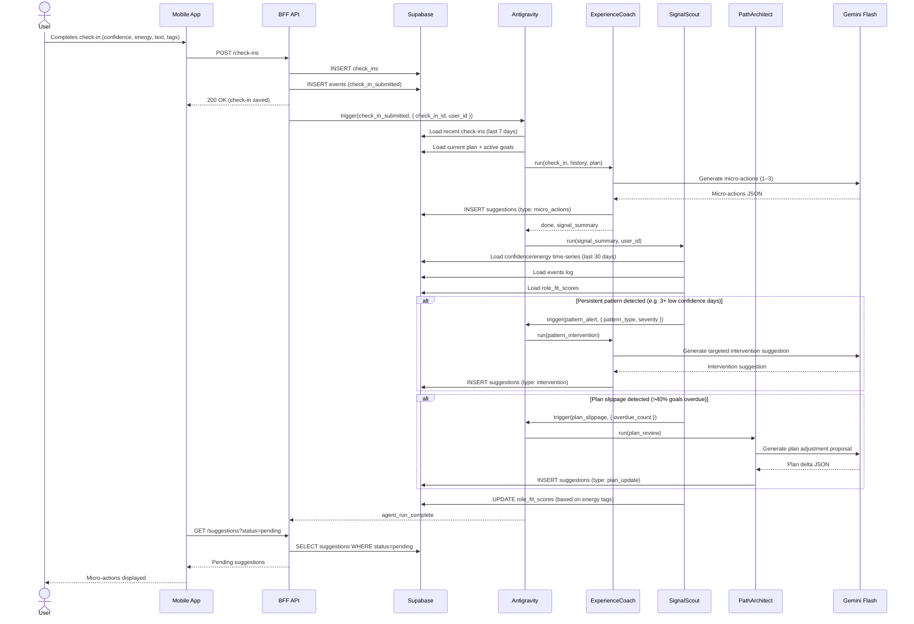
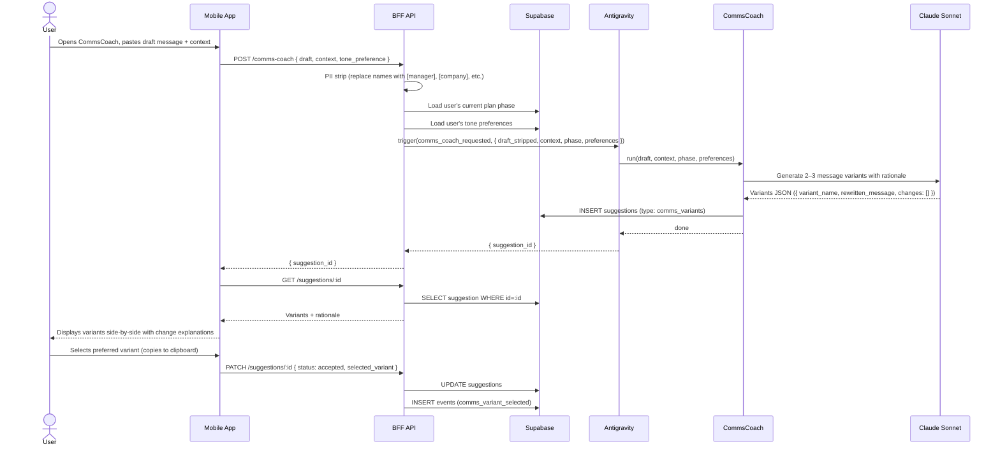
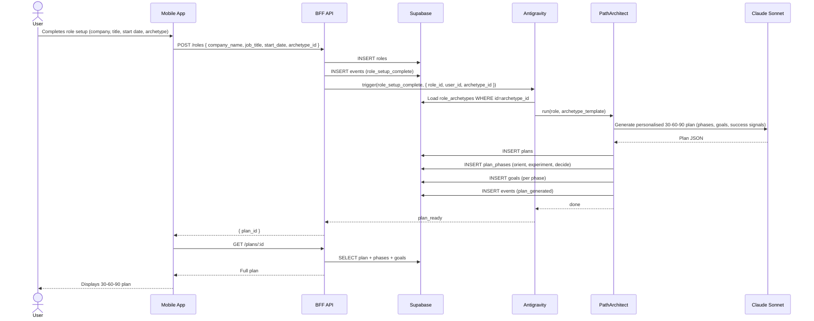

# Agent Flows — First90

This document describes the two primary agent interaction flows using sequence diagrams.

---

## Flow 1: Daily Check-in → ExperienceCoach → SignalScout

This is the core daily loop. It runs every evening when the user completes a check-in.

### Notes
- The App polls for suggestions after submitting the check-in (or uses a Supabase Realtime subscription).
- ExperienceCoach always runs. SignalScout pattern detection and PathArchitect plan review are conditional.
- All suggestions require user acceptance before any state changes to plans or goals.
- Gemini Flash is used throughout this flow for latency. Claude is not called here.

---

## Flow 2: CommsCoach (On-Demand)

The user pastes a draft message or names a situation. CommsCoach returns variants with explanations.

### Notes
- PII stripping happens in the BFF API before any text reaches Claude. Names, company names, and colleague references are replaced with typed placeholders.
- Claude Sonnet is used here (not Gemini) because message quality and nuance are more important than speed for communications coaching.
- The user copies their chosen variant manually — the app never sends a message on their behalf.
- If a "tough conversation" task is due in the user's plan (e.g. "have development chat with manager"), CommsCoach can be triggered proactively by SignalScout. The flow is identical except the trigger is `proactive_script_needed` rather than `comms_coach_requested`.

---

## Flow 3: Role Setup → PathArchitect (Initial Plan Generation)

Runs once when the user completes onboarding.

### Notes
- This is the most important LLM call in the product. Plan quality at this step sets the tone for the entire 90-day experience. Claude Sonnet is used.
- The plan is written directly to Supabase (no `suggestions` table step) because it is the initial state, not a change proposal.
- If the user does not select an archetype during onboarding, PathArchitect uses a generic "early-career professional" template and refines it after the first 2 weeks of check-in data.
