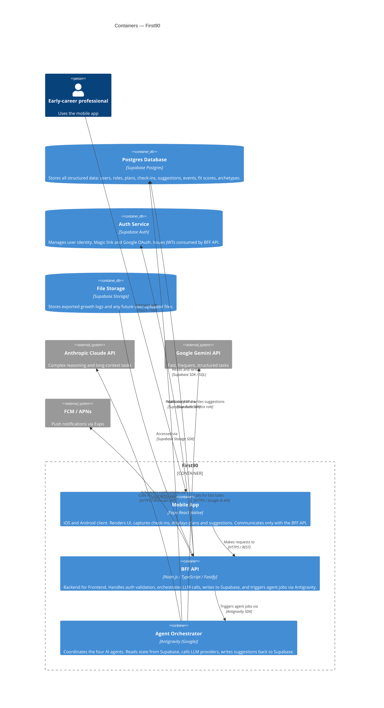

# Containers — First90 (C4 Level 2)

This diagram zooms into the First90 system boundary and shows the major containers (applications and data stores) and how they communicate.

## Container Descriptions

### Mobile App (Expo React Native)
The user-facing client. Built with Expo SDK and Expo Router for file-based navigation. The app is intentionally thin — it renders UI, captures user input, and displays data returned by the BFF API. It never calls LLM APIs directly. All state is server-authoritative; the app holds only ephemeral UI state locally.

Platforms: iOS (primary), Android (secondary), Expo Web (stretch goal).

### BFF API (Node.js / TypeScript)
The Backend for Frontend sits between the mobile app and all backend services. Responsibilities:
- Validate Supabase JWTs on every request
- Translate app requests into Supabase reads/writes
- Trigger Antigravity agent jobs when appropriate events occur (e.g. check-in submitted, plan update accepted)
- Handle push notification scheduling
- Apply PII stripping before any text reaches an LLM provider

Hosted on Google Cloud Run (serverless, scales to zero). Stateless — all state lives in Supabase.

### Agent Orchestrator (Antigravity)
Coordinates the four AI agents. Receives jobs from the BFF API (e.g. `check_in_submitted`, `role_setup_complete`), loads relevant state from Supabase via a service role, calls Claude or Gemini as appropriate, and writes the resulting suggestions back to the `suggestions` table in Supabase. The mobile app then surfaces these suggestions to the user for acceptance.

All agent logic, prompt templates, and routing rules live here. See `03-agents/` for individual agent specs.

### Postgres Database (Supabase)
The system of record for all structured data. Row Level Security (RLS) is enabled on all tables — users can only access their own data. The orchestrator accesses the database via a service role (bypasses RLS) for reading cross-user archetype data and writing agent outputs.

### Auth Service (Supabase Auth)
Handles user identity. Supports magic link (email) and Google OAuth. Issues short-lived JWTs that the BFF API validates on every request. No passwords stored.

### File Storage (Supabase Storage)
Used for exporting the user's "growth log" (90-day summary) as a PDF. May also be used for future features such as CV uploads or document context for CommsCoach.
