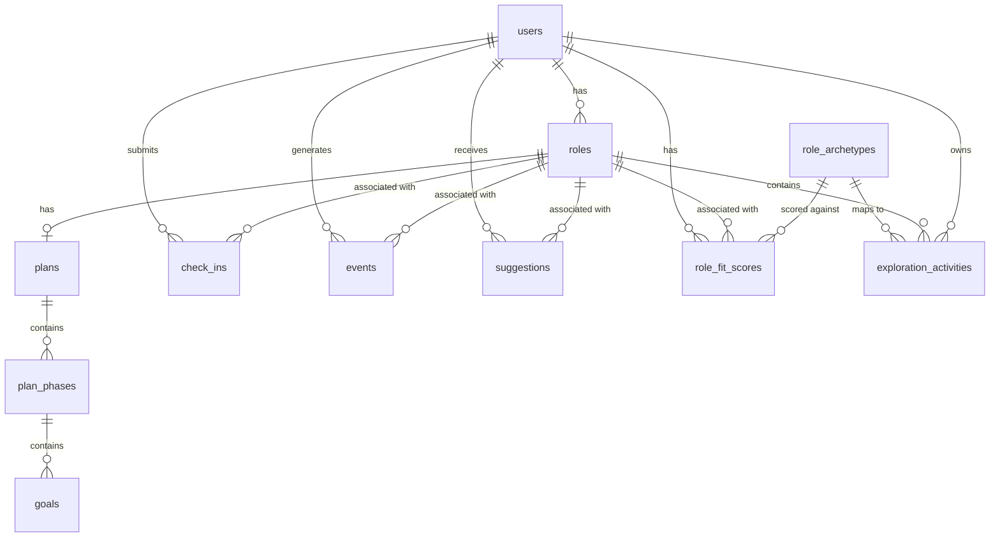

# Data Model — First90

This document defines the full Supabase Postgres schema for First90, including table definitions, relationships, indexes, and Row Level Security (RLS) policies.

---

## Entity Relationship Diagram



---

## Schema DDL

### `users`

```sql
create table public.users (
  id          uuid primary key references auth.users(id) on delete cascade,
  email       text not null unique,
  full_name   text,
  timezone    text not null default 'Europe/London',
  preferences jsonb not null default '{}',
  created_at  timestamptz not null default now(),
  updated_at  timestamptz not null default now()
);

comment on table public.users is 'Extended profile for authenticated users. Mirrors auth.users.';
comment on column public.users.preferences is 'User preferences: tone_mode, privacy_mode, notification_time, etc.';

create index users_email_idx on public.users(email);
```

**RLS:**
```sql
alter table public.users enable row level security;

create policy "Users can read own profile"
  on public.users for select
  using (auth.uid() = id);

create policy "Users can update own profile"
  on public.users for update
  using (auth.uid() = id);
```

---

### `roles`

```sql
create table public.roles (
  id           uuid primary key default gen_random_uuid(),
  user_id      uuid not null references public.users(id) on delete cascade,
  company_name text not null,
  job_title    text not null,
  start_date   date not null,
  end_date     date,
  archetype_id uuid references public.role_archetypes(id),
  is_active    boolean not null default true,
  created_at   timestamptz not null default now(),
  updated_at   timestamptz not null default now()
);

comment on table public.roles is 'A job or role held by a user. One user may have multiple roles over time but only one active role.';
comment on column public.roles.archetype_id is 'The role archetype selected at onboarding. May be null if user skipped archetype selection.';

create index roles_user_id_idx on public.roles(user_id);
create index roles_active_idx on public.roles(user_id) where is_active = true;
```

**RLS:**
```sql
alter table public.roles enable row level security;

create policy "Users can manage own roles"
  on public.roles for all
  using (auth.uid() = user_id);
```

---

### `plans`

```sql
create table public.plans (
  id         uuid primary key default gen_random_uuid(),
  role_id    uuid not null references public.roles(id) on delete cascade,
  user_id    uuid not null references public.users(id) on delete cascade,
  status     text not null default 'active' check (status in ('active', 'completed', 'archived')),
  created_at timestamptz not null default now(),
  updated_at timestamptz not null default now()
);

comment on table public.plans is 'The 30-60-90 day plan for a given role. One plan per role.';

create unique index plans_role_id_unique on public.plans(role_id);
create index plans_user_id_idx on public.plans(user_id);
```

**RLS:**
```sql
alter table public.plans enable row level security;

create policy "Users can manage own plans"
  on public.plans for all
  using (auth.uid() = user_id);
```

---

### `plan_phases`

```sql
create table public.plan_phases (
  id             uuid primary key default gen_random_uuid(),
  plan_id        uuid not null references public.plans(id) on delete cascade,
  phase_number   int not null check (phase_number in (1, 2, 3)),
  name           text not null,           -- 'Orient & Observe' | 'Experiment & Explore' | 'Decide & Position'
  theme          text not null,           -- one-line theme for this phase
  start_day      int not null,            -- 1, 31, 61
  end_day        int not null,            -- 30, 60, 90
  created_at     timestamptz not null default now()
);

comment on table public.plan_phases is 'The three phases within a 30-60-90 plan.';

create unique index plan_phases_plan_phase_unique on public.plan_phases(plan_id, phase_number);
```

**RLS:** Inherited via plan — agents use service role for writes. Users query via join with `plans`.

```sql
alter table public.plan_phases enable row level security;

create policy "Users can read own plan phases"
  on public.plan_phases for select
  using (
    exists (
      select 1 from public.plans
      where plans.id = plan_phases.plan_id
      and plans.user_id = auth.uid()
    )
  );
```

---

### `goals`

```sql
create table public.goals (
  id              uuid primary key default gen_random_uuid(),
  plan_phase_id   uuid not null references public.plan_phases(id) on delete cascade,
  title           text not null,
  description     text,
  success_signal  text,                   -- what "done" looks like
  status          text not null default 'todo'
                  check (status in ('todo', 'in_progress', 'done', 'skipped')),
  due_day         int,                    -- suggested completion day (relative to role start)
  source          text not null default 'agent'
                  check (source in ('agent', 'user')),
  created_at      timestamptz not null default now(),
  updated_at      timestamptz not null default now()
);

comment on table public.goals is 'Individual goals within a plan phase. Created by PathArchitect or manually by user.';
comment on column public.goals.success_signal is 'A concrete, observable indicator that this goal is complete.';

create index goals_plan_phase_id_idx on public.goals(plan_phase_id);
create index goals_status_idx on public.goals(status);
```

**RLS:** Users query via join chain `goals → plan_phases → plans → user_id`.

```sql
alter table public.goals enable row level security;

create policy "Users can read and update own goals"
  on public.goals for all
  using (
    exists (
      select 1 from public.plan_phases pp
      join public.plans p on p.id = pp.plan_id
      where pp.id = goals.plan_phase_id
      and p.user_id = auth.uid()
    )
  );
```

---

### `check_ins`

```sql
create table public.check_ins (
  id                uuid primary key default gen_random_uuid(),
  user_id           uuid not null references public.users(id) on delete cascade,
  role_id           uuid not null references public.roles(id) on delete cascade,
  date              date not null,
  confidence_score  int not null check (confidence_score between 1 and 10),
  energy_score      int not null check (energy_score between 1 and 10),
  free_text         text,                 -- optional; processed on-device in private mode
  tags              text[] not null default '{}',
  created_at        timestamptz not null default now()
);

comment on table public.check_ins is 'Daily or 3x-weekly user check-ins. Confidence and energy scores are always stored. Free text is optional and may be processed on-device only.';
comment on column public.check_ins.free_text is 'User''s free-text reflection. Stored server-side only if user is in Standard privacy mode.';
comment on column public.check_ins.tags is 'Array of selected tags from the predefined vocabulary (Feelings/Context: meetings, deadlines, relationships, workload, learning, unclear_expectations, imposter_syndrome, win; Activities: data_analysis, strategy, coding, client_calls, writing, process_improvement, people_interaction, financial_analysis)';

create unique index check_ins_user_date_unique on public.check_ins(user_id, date);
create index check_ins_user_id_idx on public.check_ins(user_id);
create index check_ins_role_id_idx on public.check_ins(role_id);
create index check_ins_date_idx on public.check_ins(date desc);
```

**RLS:**
```sql
alter table public.check_ins enable row level security;

create policy "Users can manage own check-ins"
  on public.check_ins for all
  using (auth.uid() = user_id);
```

---

### `events`

```sql
create table public.events (
  id          uuid primary key default gen_random_uuid(),
  user_id     uuid not null references public.users(id) on delete cascade,
  role_id     uuid references public.roles(id) on delete set null,
  event_type  text not null,
  payload     jsonb not null default '{}',
  created_at  timestamptz not null default now()
);

comment on table public.events is 'Append-only event log. Records all significant user and agent actions. Never updated or deleted.';
comment on column public.events.event_type is 'Examples: role_setup_complete, check_in_submitted, suggestion_accepted, plan_updated, goal_completed, comms_variant_selected';

create index events_user_id_idx on public.events(user_id);
create index events_type_idx on public.events(event_type);
create index events_created_at_idx on public.events(created_at desc);
```

**RLS:**
```sql
alter table public.events enable row level security;

-- Users can read their own events
create policy "Users can read own events"
  on public.events for select
  using (auth.uid() = user_id);

-- Only service role can insert (via BFF API)
-- No user insert policy — all writes go through the API
```

---

### `suggestions`

```sql
create table public.suggestions (
  id               uuid primary key default gen_random_uuid(),
  user_id          uuid not null references public.users(id) on delete cascade,
  role_id          uuid references public.roles(id) on delete set null,
  agent_name       text not null
                   check (agent_name in ('PathArchitect', 'ExperienceCoach', 'CommsCoach', 'SignalScout')),
  suggestion_type  text not null,
  -- micro_actions | plan_update | intervention | comms_variants | proactive_script | fit_check
  content          jsonb not null,
  status           text not null default 'pending'
                   check (status in ('pending', 'accepted', 'dismissed', 'expired')),
  created_at       timestamptz not null default now(),
  actioned_at      timestamptz,
  expires_at       timestamptz
);

comment on table public.suggestions is 'All agent output proposals. Users accept, dismiss, or let them expire. Nothing in the plan changes without a record here first.';
comment on column public.suggestions.content is 'JSON payload varies by suggestion_type. See agent specs in 03-agents/ for schema per type.';

create index suggestions_user_id_idx on public.suggestions(user_id);
create index suggestions_status_idx on public.suggestions(user_id, status) where status = 'pending';
create index suggestions_agent_idx on public.suggestions(agent_name);
```

**RLS:**
```sql
alter table public.suggestions enable row level security;

-- Users can read their own suggestions and update status
create policy "Users can read own suggestions"
  on public.suggestions for select
  using (auth.uid() = user_id);

create policy "Users can update own suggestion status"
  on public.suggestions for update
  using (auth.uid() = user_id)
  with check (status in ('accepted', 'dismissed'));

-- Agents write via service role only
```

---

### `role_archetypes`

```sql
create table public.role_archetypes (
  id                  uuid primary key default gen_random_uuid(),
  name                text not null unique,
  slug                text not null unique,
  description         text not null,
  typical_tasks       text[] not null default '{}',
  energising_markers  text[] not null default '{}',
  draining_markers    text[] not null default '{}',
  skills_developed    text[] not null default '{}',
  transition_paths    text[] not null default '{}',
  created_at          timestamptz not null default now()
);

comment on table public.role_archetypes is 'Library of early-career role archetypes. Public read. Managed by First90 team.';
comment on column public.role_archetypes.energising_markers is 'Tags and task types that, when rated high-energy in check-ins, increase fit score for this archetype.';
```

**RLS:**
```sql
alter table public.role_archetypes enable row level security;

-- Public read — no auth required for archetype library
create policy "Anyone can read role archetypes"
  on public.role_archetypes for select
  using (true);
```

---

### `role_fit_scores`

```sql
create table public.role_fit_scores (
  id            uuid primary key default gen_random_uuid(),
  user_id       uuid not null references public.users(id) on delete cascade,
  role_id       uuid not null references public.roles(id) on delete cascade,
  archetype_id  uuid not null references public.role_archetypes(id),
  score         numeric(4,2) not null default 0 check (score between 0 and 10),
  data_points   int not null default 0,  -- number of check-ins contributing to score
  last_updated  timestamptz not null default now(),

  unique (user_id, role_id, archetype_id)
);

comment on table public.role_fit_scores is 'Computed fit scores per user per archetype, updated by SignalScout after each check-in.';
comment on column public.role_fit_scores.score is 'Fit score from 0–10. Increases when high-energy check-in tags match archetype energising_markers.';
comment on column public.role_fit_scores.data_points is 'Number of check-ins that have contributed to this score. Used to calibrate confidence in the score.';

create index role_fit_scores_user_role_idx on public.role_fit_scores(user_id, role_id);
```

**RLS:**
```sql
alter table public.role_fit_scores enable row level security;

create policy "Users can read own fit scores"
  on public.role_fit_scores for select
  using (auth.uid() = user_id);

-- SignalScout writes via service role only
```

---

### `exploration_activities`

```sql
create table public.exploration_activities (
  id             uuid primary key default gen_random_uuid(),
  user_id        uuid not null references public.users(id) on delete cascade,
  role_id        uuid not null references public.roles(id) on delete cascade,
  archetype_id   uuid references public.role_archetypes(id),
  activity_type  text not null
                 check (activity_type in ('coffee_chat', 'shadowing', 'mini_project', 'self_reflection', 'informational_interview')),
  title          text not null,
  description    text,
  status         text not null default 'scheduled'
                 check (status in ('scheduled', 'completed', 'skipped')),
  scheduled_day  int,                    -- suggested day relative to role start
  completed_at   timestamptz,
  created_at     timestamptz not null default now()
);

comment on table public.exploration_activities is 'Specific experiments and exploration tasks generated by PathArchitect to help the user discover role-fit.';
comment on column public.exploration_activities.archetype_id is 'The archetype this activity is designed to explore. Null if general exploration.';

create index exploration_activities_user_role_idx on public.exploration_activities(user_id, role_id);
create index exploration_activities_archetype_idx on public.exploration_activities(archetype_id);
```

**RLS:**
```sql
alter table public.exploration_activities enable row level security;

create policy "Users can manage own exploration activities"
  on public.exploration_activities for all
  using (auth.uid() = user_id);
```

---

## Migrations

Migration files live in `supabase/migrations/`. Naming convention:

```
20260523000001_create_users.sql
20260523000002_create_roles.sql
20260523000003_create_plans.sql
20260523000004_create_plan_phases.sql
20260523000005_create_goals.sql
20260523000006_create_check_ins.sql
20260523000007_create_events.sql
20260523000008_create_suggestions.sql
20260523000009_create_role_archetypes.sql
20260523000010_create_role_fit_scores.sql
20260523000011_create_exploration_activities.sql
20260523000012_seed_role_archetypes.sql
```

---

## Notes

- All tables use `uuid` primary keys generated with `gen_random_uuid()`.
- All tables have `created_at timestamptz not null default now()`.
- Tables with mutable state have `updated_at timestamptz not null default now()` — update via a Postgres trigger or app-level.
- `events` is append-only. Never issue `UPDATE` or `DELETE` on this table.
- `free_text` on `check_ins` is only stored server-side in Standard privacy mode. In Private mode, it is processed on-device and only the derived `tags` and scores are synced.
- The `suggestions.content` JSONB schema varies per `suggestion_type`. See individual agent specs in `03-agents/` for the exact payload structure per type.
