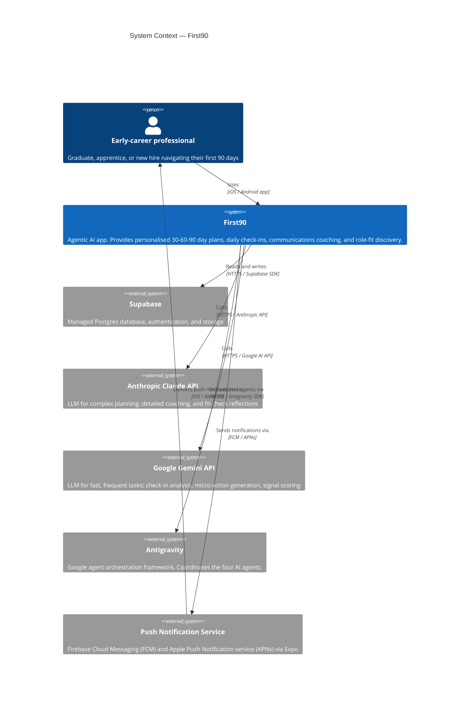

# System Context — First90 (C4 Level 1)

This diagram shows First90 at the highest level: the people who interact with it and the external systems it depends on.

## Explanation

**The user** is an early-career professional using the First90 mobile app. They interact entirely through the iOS or Android client — they have no direct contact with any backend system.

**First90** is the overall system boundary. Internally it consists of a React Native mobile client, a Node/TypeScript BFF API, and an agent orchestration layer. From the outside, it appears as a single app.

**Supabase** acts as the system of record: structured data (plans, check-ins, suggestions, events, fit scores) and user authentication. First90 never stores sensitive data in the cloud without user consent — see `privacy.md`.

**Anthropic Claude** handles the tasks that benefit most from deep reasoning and long-context understanding: initial plan generation, detailed communications coaching, and 45/90 day fit-check reflections.

**Google Gemini** handles high-frequency, lower-latency tasks: parsing daily check-ins, generating micro-actions, and computing signal scores. Gemini Flash is preferred here for cost and speed.

**Antigravity** is Google's Gemini-native agent orchestration framework. It coordinates the four First90 agents (PathArchitect, ExperienceCoach, CommsCoach, SignalScout), manages their state access, and routes events between them.

**Push Notification Service** (FCM + APNs via Expo) delivers the evening check-in reminder and any time-sensitive agent nudges to the user's device.
